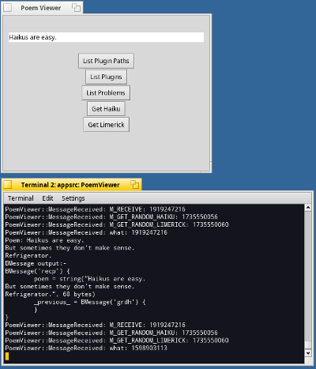

# An Example generic Haiku plugin API

Currently on Haiku each app has its own entry point in to each library.
Whilst fine for the majority of use cases for extending individual apps, 
when a single library can be used by multiple apps this mechanism quickly becomes unwieldy.

This repository makes an attempt at using a many:many plugin add-on API. This
builds on the existing add-ons/APP/myaddon convention to create generic
plugin libraries that can be invoked by multiple client apps.

Also currently a lot of image handling logic has to be created within
each app. This has been abstracted out in this library, making app
developers' lives much easier.

## What examples are provided

The following directories provide various examples:-

- apisrc - The source code for the core API (Plugin and Plugin Manager)
- appsrc - The Poem Viewer app - a consumer of plugins - Only 6 lines of code are used to invoke the 2 protocols needed for this app
- pluginsrc - The GetHaikuPlugin that implements the GetHaiku and GetLimerick procotols - Only 7 lines of code are used to provide the 2 protocols implemented, and support replies to those calls

Below is an image of the app running, asking for a poem and displaying the reply:-

Other plugin information:-
- MessageTest - A small sample of taking a BMessage and packing/unpacking it. A basic functionality test.
- DeveloperDocs - Archi format design documents, with png image exportss

## Building the examples

All examples are Paladin project files. Build them in this order:-

- apisrc
- pluginsrc
- appsrc

Once built, copy the pluginsrc/GetHaikuPlugin file in to your /system/non-packaged/addons/MessagePlugin/ folder. This folder will need creating the first time. PluginManager will look for Message Plugins in this folder. (And other similar paths in the system, as per normal Haiku directory_find rules).

## Running the examples

Just execute the following:-

``sh
cd appsrc
./PoemViewer
``

Then click on the 'Get Haiku' or 'Get Limerick' buttons. If all is well, you should see a poem appear

## Design of the Plugin API

Please read the [Design Document](DeveloperDocs/design.md)

## License and Copyright

All contents of this repository are Copyright Adam Fowler 2018. All code is licensed under the MIT license. See the [LICENSE](LICENSE) file for details.

## Contributing

Please contact Adam Fowler at adamfowleruk at gmail dot com if you'd like to help out, or contact me on IRC (on Freenode #haiku as adamfowleruk).
